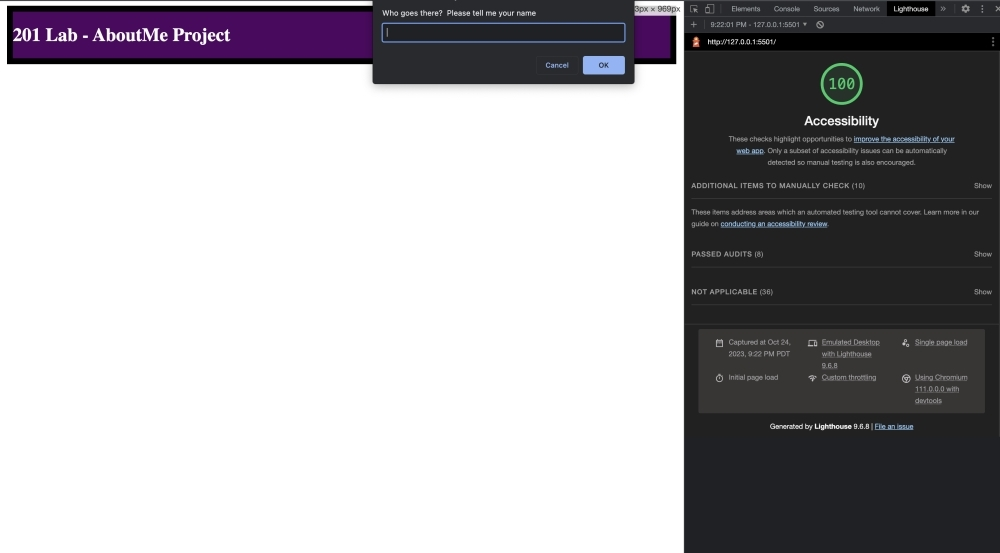

# AboutMe
201 project (starting with Lab 2 on 10/24/2023)

### 🦋 Author: Myra Reeves

## Project Name:  AboutMe Lab

Quoted instructions from the Lab 2 assignment on Canvas:
>Build out an “About Me” webpage that quizzes the user on fun facts gives the user some basic information about who you are and where you came from.
>
> 
>
>* Create an About Me guessing game that utilizes HTML, CSS, & JavaScript.
>* Include on your HTML page a short biography, your education history, an overview of your job experience, and any goals that you may have.
>* Prompt the user a total of exactly five yes or no questions. The user input for the answer must accept either y/n or yes/no responses while taking into consideration case sensitivity by normalizing the user input so that it can be validated (hint: look into the `.toUpperCase()` or `.toLowerCase()` functions). Be sure to let the user know if they answered the question correctly by alerting them with a response.
>* `Add console.log()` messages within your app to notify the user if they are correct. Before submitting, comment out (don’t delete) your `console.log()` messages and replace them with the `alerts()` to complete the project.
>
> 
>
>* Ask the user their name through a `prompt()`
>* Display that name back to the user through a custom greeting welcoming them to your site.
>* Display the user’s name back to them in your final message to the user.
>
> 
>
>### Developer Style Guide
>
>A style guide is a series of standards and practices that must be followed in order for your code to be accepted by the team. This can include variable naming, file structure, and process. Below is a list of practices that you will be required to follow within this lab:
>* Your JS file must contain a `'use strict'` declaration at the top, and your javascript file must be linked in your html file as an external script file.
>* Make sure that all code is cleanly written with correct indentation and syntax. Look at an example [JavaScript Style Guide](https://javascript.info/coding-style#syntax). Note that your JS must pass the rules in the linter that you installed.

### Links and Resources

* [Setting Up A New 201 Code Project](https://codefellows.github.io/code-201-guide/curriculum/class-02/project-setup)
* [CodeFellows provided linter code](https://github.com/codefellows/seattle-code-201d106/blob/main/configs/.eslintrc.json)
* [CodeFellows provided .gitignore code](https://github.com/codefellows/seattle-code-201d106/blob/main/configs/.gitignore)
* [Default 201 README template](https://codefellows.github.io/code-201-guide/curriculum/class-02/README-template.html)
* [JavaScript Style Guide.](https://javascript.info/coding-style#syntax)
* [Eric Meyer’s reset.css file ](https://meyerweb.com/eric/tools/css/reset/)

### Lighthouse Accessibility Report Score

* 100%  Woot!

)

### Reflections and Comments

* Consider including the answers to your daily journal and submission questions here
* This is also a good place to reflect on the tools and resources used and learned
